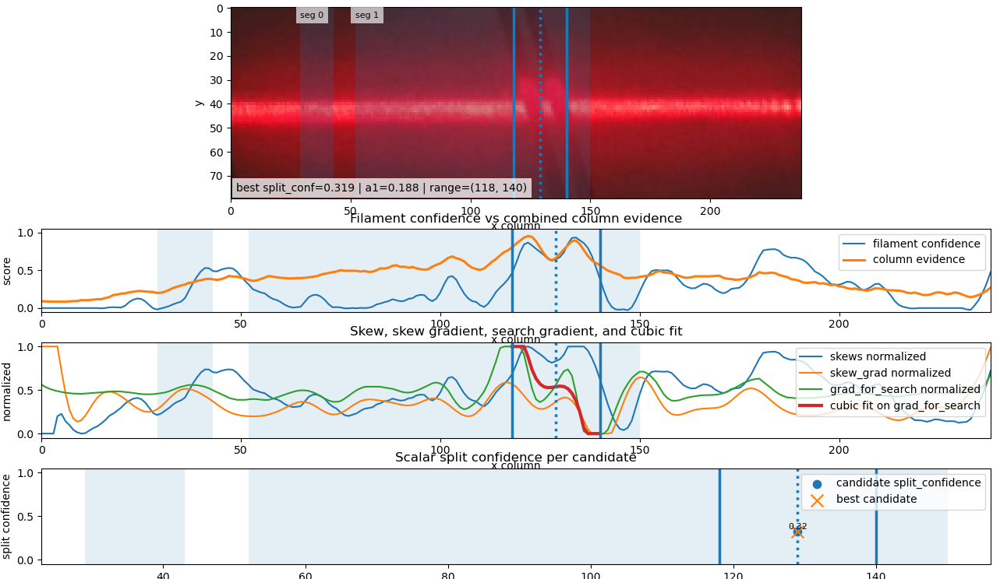
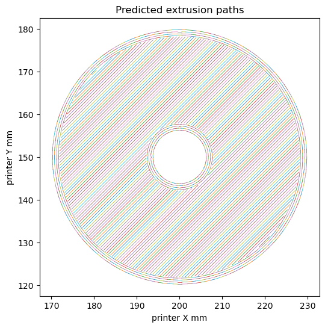
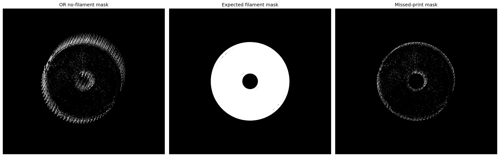
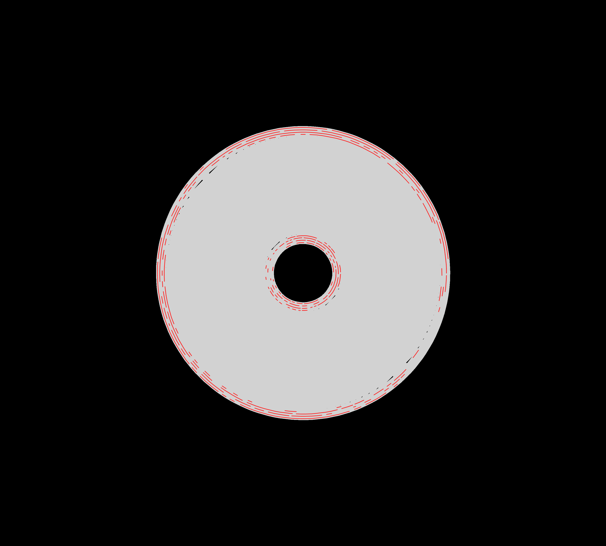
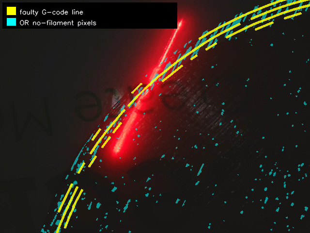

# Laser-based Filament defect extraction

## Klipper custom commands
TEST_ACCURACY : This runs the print defined in the config "test_print". 


This command was as it was initially meant to be used to start a print and report the accuracy of a model. It would under extrude in certain parts of the print, and compare that to the model's report. This functionality has since been removed in favor of manual analysis of photos for now. It also connects smoothly with CAMERA_STATUS

CAMERA_STATUS: A way to activate and deactivate the webcam, activating when current tool is 0 and deactivating when otherwise, adding DEACTIVATE=1 will force deactivate. 


This functionality was implemented in this way so that it would be more robust to automatically put into prints and turn on and off the camera. Changing to a simpler turn-on turn-off command for manual input would not be difficult. 

This will then continually send frames into a folder defined in the config, with the print time, x,y,z coords added in the name. Refer to klipper internals section to understand accuracy behind this. 

## Klipper internals
The klippy modules are not well documented. Basic explanation of very abstracted functions exist, but to get close to the printer reading the klippy modules is good. Here are some findings I have used a lot whilst building these commands. 
### Some basic klippy objects
reactor : a python object that allows klipper to queue and run tasks at a certain time, and reacts to events. Backbone of the framework

printer: object that is easiest to interact with the printer through, handles mostly everything and allows you to get other objects through it

gcode_move: Handles the move commands, position calcuation and speed settings. 

### Command internals

Abusing the direct connection between klipper module and klippy is the best way to lower latency between an automatic request of something and the printer actually doing it.

For example, command M221, used to change the extrusion factor would be queued until a full move was executed, making it not work for the use case. Instead, you can build a command like: 
```
def cmd_221(self, f):
        gm = self.gcode_move
        last_e_pos = gm.last_position[3]
        e_value = (last_e_pos - gm.base_position[3]) / gm.extrude_factor
        gm.base_position[3] = last_e_pos - e_value * f
        gm.extrude_factor = f
```
Which is a near direct copy of the original command, but wont be queud and slow like a run_command call would be

Another use of this was the position. Simply calling the get_position API through an http request or a gcode_move object wouldn't work. Internally, this calculates the predicited coordinates at the end of the current move, meaning it wouldn't represent the location the camera was capturing. Instead, I recorded the eventtime a photo was taken, them used the "motion_status" object at that eventtime, and got "live_position" from it. 
# Laser analysis
# Centerline extraction
This research was more for understand the actual physical property of the filament, the thickness, and not missing/there. 

Finding the mean, peak and other simple columnwise centers works fairly well, but light refractions and actual deviations of the centerline sway these in the same way(similar to the template matching failures). 

Hessian based method:
Smooth the image using different sized kernel based on an estimated width of the laser at that point. Then, find points with the highest eigenvalue of their hessian. This resembles a peak in the 3d intensity function. Smooth these points along a line to get subpixel estimates of the centerline. This wasn't as accurate as needed for such precise mm extraction of shape. 

An assumption of saturation:
The laser is very strong meaning that the camera likely can not represent the genuine strongest parts of the image, meaning the center and shoulders of the laser will have similar intensity, near max. Trying to use this idea was hard, taking away maxed out pixels and using the ones around it to guess the actual pixel intensity. But no pixel was truely over-saturated, just the red value was high, making understanding which pixels were over saturated and underrepresented difficult. This work also relates to the other models, helping understand the pixels true value. 
# Column based models

Rotating a laser to horizontal, then analyzing the distributions of columns

### Initial gaussian sigma analysis: 
This simple extractor fits a gaussian to each column, and uses the standard deviation to detect changes in the laser line. If there is a large derivitave in this column-wise sigma function, this signified to my model that it is likely a new region of the laser is starting. This model is fairly accurate, but heavily influenced by the background letters and flashes coming of the filament. Using a threshold before fitting the gaussian can help with magnifying this derivative to more easily detect changes, and using the amplitude and redness of the fit can help you determine if this segment is actually filament

### Change in skew:
This model used the idea that the laser should be heavily skewed upwards when hitting filament, as the main central line will stay similar but the light will get relflected back towards the laser. Using the same change in column-wise function, taking the argmax and argmin of this indicator gives a more refined estimate. 

It is also possible to detect slight underextrusion between 2 lines of filament with this, and the skew derivative becomes very similar to a 3rd degree function. The strength in the linear term coeffiecient indicates the return of the skew towards positive, showing a part of the filament is not as strong as the rest. This still needs work however.

The transparent regions are the ones detected from change in sigma, and the lines are the min and max of skew gradients within the region. The skew gradient is biased towards the center by multiplying it with a gaussian distrobution using the prior that the filament is more likely in the middle, creating the "search gradient" plot. Split confidence is based on a ratio between the first degree coeffiecent and the rest in the fitting of the region, it is currently not an even distrobution, biasing no split. 
##  Pixel based model

These have more use as they give an exact location of where defects are. However, it is provably inable to be accurate as multiple pixels with different truth labellings are exactly the same in RGB, but the surroundings make the pixel different. However, these are the highest accuracy basic model I used, especially because of their output being a precise location. 

The physical based prior that I used was that the filament was red, and the background was white. So, the higher the red is compared to the other colors, the more likely filament is not in that pixel. 

Using a different colorspace than RGB is the most important take away from my work on this model. The color red is lower energy than the others, so when doing a transformation from RGB to a gray scale, using the YCrCB color space, and taking the Y for luminosity allows you to easily see the true energy coming from that laser, giving a much cleaner line than normal gray function. 

This colorspace also gives you Cr and Cb, the red difference and blue difference of the pixel. Using this: 
```(ycrcb[:, :, 0] / np.clip((ycrcb[:, :,  1] - ycrcb[:, :, 2] + 1e-9), 12, None))```
as the likelyhood of background combined all of these priors. This function rewards luminosity and a low difference in red-blue chroma. The clip keeps numerical stability. For extra stability, I used a 3x3 smoothing kernel and a 3x3 elliptical morpholigical opening
##  Ineffective models:
### Template matching/ full distribution comparison

This seems like it might work, fit a distribution or create a column that looks like filament or looks like background, and then use the matching score as a segmentor of the laser. However, these fittings will end up looking very similar to eachother, just the background has a much stronger peak. This means that the matching score becomes very similar mathematically to gaussian smoothing, with the filament score having a higher sigma kernel, which will be noisy and difficult to use. 

This could be remedied slightly by keeping the center of the laser fixed, but this introduces a new problem. Keeping the center of the laser in the exact same place is a difficult task for either the cropping algorithm or the 3d print. There is little correlation with the laser center and the z-axis, my initial guess of why it was moving. Likely the laser center is altered because of the thickness of the filament, making it difficult to match with a distribution or fix in testing. 
### Psuedo-voigt digital twin
The psuedo-voigt distrobution, a mix between gaussian and voigt, is a near perfect fit to the column-wise laser intensity plot. This allowed me to take a laser that was fully hitting filament, and fully hitting the backplate, and create a distrobution that would represent the laser at that point. Using the gcode, you can generate an ideal image, and detect errors by diffing it with the original. This needed me to adjust where the centers were, empty line and full, which proved to be difficult as they adjust due to the thickness. You can also make the distrobution by taking median of the the columns, giving a less smoothed twin. 

# Using the result

## GCODE extraction. 
Slice the object you want to print, get the GCODE file and use that as a way to understand what is expected per layer. This gives you super accurate measurement of how the layer was sliced and positions in the printer's coordinate system. 

## Determine what is wrong
Using the output of no-filament vs filament from the laser models, AND a no-filament mask with a predicted mask parsed from the GCODE file to get the points that the extruder missed. This will be grainy, and the smoothness will depend on the FPS of the camera. 

The title OR mask is from the method ORing together all expected masks from each frame. This works better than a voting method because in theory, the filament can never be revisited so OR wont bias thicker areas
## Smooth by segment

Determine which segments went wrong will allow the printer to redo them easier. It is possible to also just reprint the exact spots that are faulty, but segments allow for a smoothing out of errors, with a higher confidence in each segment that it was misprinted. 



# Future paths

## Better data
Print a known path, and have no errors. Know exactly what you expect the sensor to detect, to get a ground truth. If you want to limit test the model, change the print to extrude nothing during a segment or similar errors, knowing exactly where and when it will do this in the print. This will allow for easier testing and validation of newer models. 

Get rid of the backplate error. Many errors come from the green words on the backplate, especially when using color based models. I have tried many methods to avoid problems with this, but the best way is to remove the error completely. 

## Combining priors- column wise and pixel wise

It is clear that individually these methods can not help in the way we need. Column-wise methods can only detect across the whole column, leaving a large range to guess where the error is. Pixel wise are unstable and pick up noise easily. A simple idea is that if the pixel is not in a column likely to be filament, it is also not likely to be filament, meaning you can combine the scores per pixel. My issue was that a majority of my column-wise methods were relative, using the derivative of the column-wise function to determine spots of change, and nothing gave an actual per-column measurement that would have global meaning. 

## Larger template

Match an image template, not a single column distribution. Rotation and scale ignorant methods would be useful here. This might still end up being very similar mathemetically to an intensity scaling due to the laser peaking in the same spot. 
## Digital twin with inferred centers
Use the original image to infer centers of the laserline. Then, create the digital twin using the templates and gcode derived truth, putting the laser at the centers. This however, would also likely fail in similar ways that the template matching did, becoming an intensity mapping instead of a distrobution and statiscal analysis. 
## Training on better data

If you have a ground truth print that was scanned, its possible to use learning methods. This however has many possible failure points due to a slight change in the 3D printing set-up resulting in out of distrobution data.  